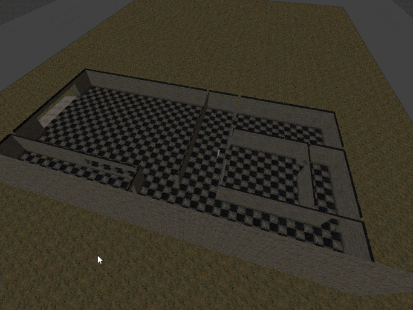

# Update 27 of July, 2024
This addon is history. It has been a while since modern versions of Blender ship with geometry nodes, a powerful tool that can basically replicate this addon, and I recommend that you use it instead of this.

# Level Buddy for Blender 3.0

**Level Buddy** is a Blender add-on originally written by Matt Lucas.

[old version available on itch.io](https://matt-lucas.itch.io/level-buddy).

## Features
- Doom-inspired sector-based level editor
- Brushes (Add and Subtract CSG operations with order support)
- Sectors can have up to 3 materials: floor + wall + ceiling
- Support for Auto and Manual UV

## Notes
- It crashes often, make sure to save work at all times
- TextureBuddy no longer exists (got merged to main code)
- Addon still has some bugs
- Yes I removed some old features
- But I also added some better features that suits fast level design

## Installing
- Download repo and unzip
- Blender -> Edit -> Preferences -> Addons -> Install -> Select LevelBuddy.py
- Enable the addon
- Make sure you delete/remove old versions

## License
This program is free software: you can redistribute it and/or modify
it under the terms of the GNU General Public License as published by
the Free Software Foundation, either version 3 of the License, or
(at your option) any later version.

This program is distributed in the hope that it will be useful,
but WITHOUT ANY WARRANTY; without even the implied warranty of
MERCHANTABILITY or FITNESS FOR A PARTICULAR PURPOSE.  See the
GNU General Public License for more details.

You should have received a copy of the GNU General Public License
along with this program.  If not, see <http://www.gnu.org/licenses/>.
